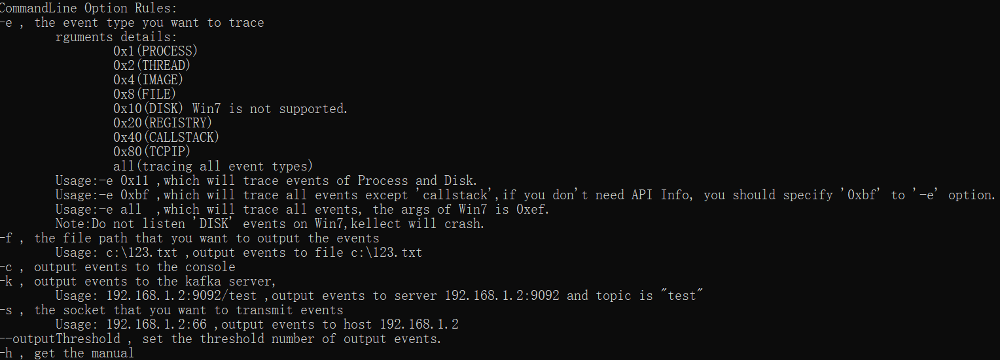

[简体中文](./README.zh-CN.md) | English 

# kellect Introduction

kellect is a multi-threaded Windows kernel log collector based on ETW(BaseEvent Tracing for Windows),developed on C++ language with high-efficient performance. kellect can track kernel level information of Windows system, such as FileIO, Process, Thread, ImageLoad, Registry and so on.

The program integrates the full functions of event collection, event analysis, event semantic correction, and event output. Output in JSON format, and can specify the output to a file path or transfer to another host through socket.

We implemented most of the functionality , which means users can use this tool via start PowerShell.exe or cmd.exe and specify the command-line options and parameters as needed without modifying source code. We also provide some configuration files that users can customize to suit their needs.

For more details, see the [Demo Paper](./demoPaper.pdf) .

For more information on the future of kellect, see the [RoadMap](#roadmap) section.


# **Implementation Details**

kellect uses a number of 3rd party libraries, as shown below. Please see LICENSE-3RD-PARTY for further details.

| Module Name                 | Module Version | LicenseUrl                                    |
|-----------------------------|----------------|-----------------------------------------------|
| easyloggingpp               | v9.96.7        | https://github.com/amraynonweb/easyloggingpp  |
| moodycamel::ConcurrentQueue | /              | https://github.com/cameron314/concurrentqueue |
| nlohmann::json              | v3.10.4        | https://github.com/nlohmann/json              |

The development of kellect  depends on the Clion, but the compilation depends on the MSVC compiler. The software and versions used for development are shown as blew:

| Tool Name     | Version  |
|---------------|-----|
| Visual Studio |   16.11.13|
| MSVC          |  19.29.30143.0  |
| Windows SDK   |  10.0.20348.0  |
| Clion         |   2022.1  |

The directory of kellect is shown as blew:

| name of directory | meaning                  |
|-------------------|--------------------------|
| include           | header files             |
| lib               | the  3rd party libraries |
| source            | source files             |
| source/config     | config files             |
| release           | executable file   |

# **kellect Manual**

## **Usage of the command-line**

After testing ,kellect can run on OS versions above win7(x64). 

Users must run this program **as administrator** , and provide some command-line options and parameters to achieve specific functions as blew.



We can collect the require data with the following command：


   ```
   kellect.exe -e 0x1 -f test.json
   ```

**Notes:** The argument to the ‘-e’ option is in the form of a decimal sum.


## **Usage of the configuration file**

There are one file users can configure: filter.txt. **Usually no modification is required unless you have customized needs.**

- The role of filter.txt is to filter events you don't need. There are three types of labels used for filtering, which are the process ID, event identifier, blacklist of image file path and whitelist of image file path. The default configuration is as follows:

```c++
filteredProcessID
0 4 128

filteredEventIdentifier
2429279289 76
2429279289 69
2429279289 74
2429279289 75
2429279289 84
2429279289 82
2429279289 80
2429279289 81
2429279289 79
2429279289 83
2429279289 86
3208270021 11
3208270021 17
3208270021 27
3208270021 26
3208270021 10
1030727888 11

blacklistOfImageFiles

whitelistOfImageFiles
```

**Label descriptions:**

1. *[filteredProcessID]* 

   means filter events according to the ID list in this label. Process IDs are separated by spaces.

2. *[filteredEventIdentifier]* 

   means filter events by the combination of BaseEvent ProviderID and opcode, which we call the EventIdentifier.

   We can find the BaseEvent information in [https://docs.microsoft.com/en-us/windows/win32/etw/fileio]. ProviderID is the decimal form of the first part of class Guid and opcode is the EventType value under the Remarks of each BaseEvent Class Page.

   

   

3. *[blacklistOfImageFiles]*

   means that we can **filter** Image and CallStack type events by the images listed in this label.

4. *[whitelistOfImageFiles]*

   means that we can **reserve** Image and CallStack type events by the images listed in this label.

# **Output Format**

We output event records in the format of JSON. Each BaseEvent has two parts of properties: common properties and private properties. The description of each part as follows:

- Common properties

| Property    | Description                                       |
| ----------- | ------------------------------------------------- |
| threadID    | Identifies the thread that generated  the event.  |
| processID   | Identifies the process that generated  the event. |
| processName | Name of the process that generated the  event.    |
| timestamp   | Contains the time that the event  occurred        |

- Private properties

  This type properties is various depends on the BaseEvent types. For example: 

1. file_create event

   | Property       | Description                                                  |
   | -------------- | ------------------------------------------------------------ |
   | IrpPtr         | IO request packet                                            |
   | TTID           | Thread identifier of the thread that is  creating the file.  |
   | FileObject     | Identifier that can be used for  correlating operations to the same opened file object instance between file  create and close events. |
   | CreateOptions  | Values passed in the CreateOptions and  CreateDispositions parameters to the NtCreateFile function. |
   | FileAttributes | Value passed in the FileAttributes  parameter to the NtCreateFile function. |
   | ShareAccess    | Value passed in the ShareAccess  parameter to the NtCreateFile function. |
   | OpenPath       | Path to the file.                                            |

2. FileIo_Name event

   | Property   | Description                                                  |
   | ---------- | ------------------------------------------------------------ |
   | FileObject | Match the value of this pointer to the **FileObject** pointer value in a [**DiskIo_TypeGroup1**](https://docs.microsoft.com/en-us/windows/win32/etw/diskio-typegroup1) event to determine the type of I/O operation. |
   | FileName   | Full path to the file, not including the drive letter.       |

 3. CallStack event . The APIs we collected is provided by Windows itself, don't collect any API in user-defined dll files.

    | Property      | Property                                                     |
    | ------------- | ------------------------------------------------------------ |
    | callStackInfo | the callstacks of the process operation.<br />  (the format of each call is like : **ModulePath:APIName**, e.g: C:\Windows\System32\ntdll.dll:LdrSystemDllInitBlock) |

 4. ...... we can find other events properties in (https://docs.microsoft.com/en-us/windows/win32/etw/msnt-systemtrace)

It should be noted that we have **modified or populated** the properties of most events, so there will be some differences between the native events provided by Windows and ours. 

The output case are as follows:

```
#FileIO Create BaseEvent
{
    "EventName":"FileIOCreate",
    "ProcessID":11144,
    "ProcessName":"clion64.exe",
    "ThreadID":15692,
    "TimeStamp":132959694278638867,
    "arguments":{
        "CreateOptions":50331744,
        "FileAttributes":128,
        "FileObject":251724112,
        "IrpPtr":116229640,
        "OpenPath":"C:\Users\Administrator\AppData\Local\JetBrains\CLion2022.1\caches\contentHashes.dat.keystream.len",
        "ShareAccess":7,
        "TTID":15692
    }
}

#Callstack event
{
    "EventName":"CallStack",
    "ProcessID":11144,
    "ProcessName":"clion64.exe",
    "ThreadID":15692,
    "TimeStamp":132959694278638867,
    "arguments":{
        "stackInfo":"C:\Windows\System32\ntdll.dll:LdrSystemDllInitBlock,
        C:\Windows\System32\ntdll.dll:LdrSystemDllInitBlock,
        C:\Windows\System32\ntdll.dll:LdrSystemDllInitBlock,
        C:\Windows\System32\ntdll.dll:LdrSystemDllInitBlock,
        C:\Windows\System32\ntdll.dll:LdrSystemDllInitBlock,
        C:\Windows\System32\ntdll.dll:LdrSystemDllInitBlock,
        C:\Windows\System32\ntdll.dll:LdrSystemDllInitBlock,
        C:\Windows\System32\ntdll.dll:LdrSystemDllInitBlock,
        C:\Windows\System32\ntdll.dll:LdrSystemDllInitBlock,
        C:\Windows\System32\ntdll.dll:LdrSystemDllInitBlock,
        C:\Windows\System32\ntdll.dll:LdrSystemDllInitBlock,
        C:\Windows\System32\ntdll.dll:LdrSystemDllInitBlock,
        C:\Windows\System32\ntdll.dll:LdrSystemDllInitBlock,
        C:\Windows\System32\ntdll.dll:RtlCaptureStackContext"
    }
}

```

# Future Work

## **RoadMap**

 1. 


